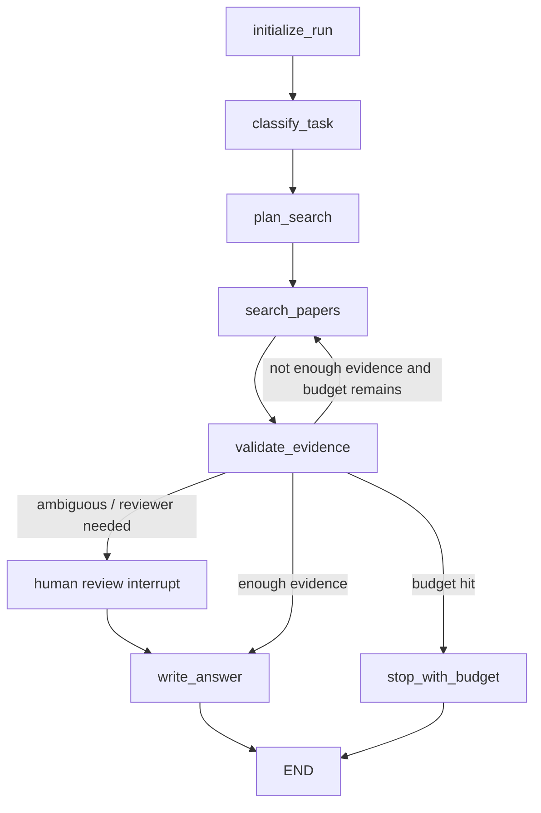

# Graph Design

## Control Flow

## Architecture Choice

Use a planner + executor + validator graph rather than a single unstructured ReAct
loop. Track A needs repeated searches, source cross-checking, and citation grounding.
The validator is a separate node so we can measure hallucinated citations and decide
whether to continue searching.

Rejected alternatives:

- Pure RAG over abstracts: weak for citation-graph questions and common-citation tasks.
- Single large prompt with all tools: harder to debug and easier to confuse tools.
- Fully multi-agent supervisor design: useful later, but too much complexity for the
  first reliable demo.

## Human-in-the-loop Interrupt

The concrete implementation should interrupt when:

- the task type is unknown;
- a paper title maps to multiple plausible records;
- the validator detects missing evidence for a requested claim;
- the next tool call would exceed a configured cost or latency threshold.

